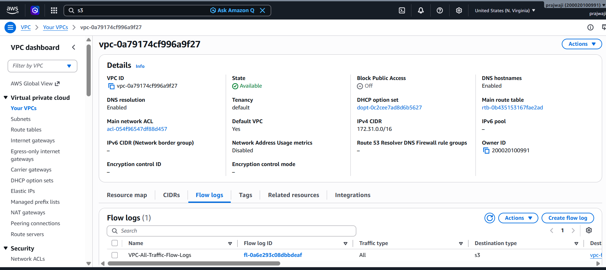
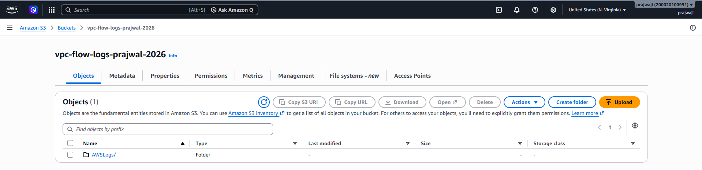
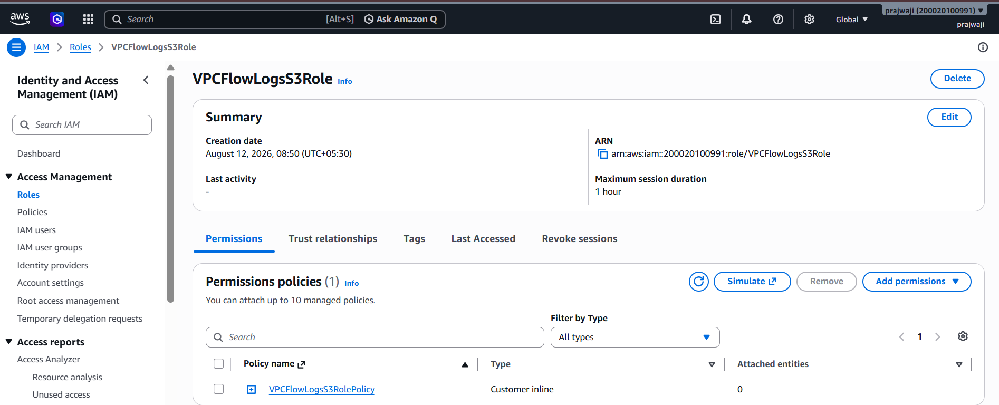
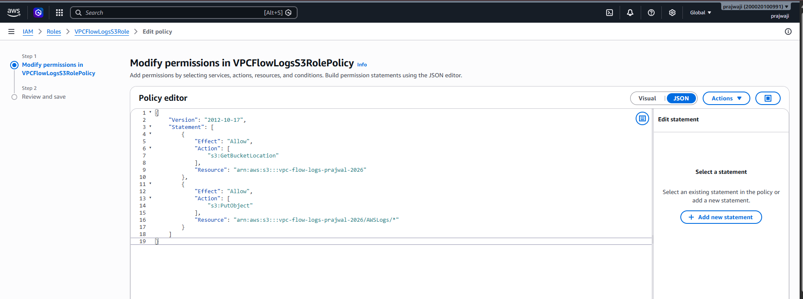
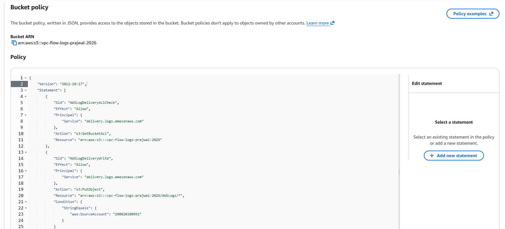
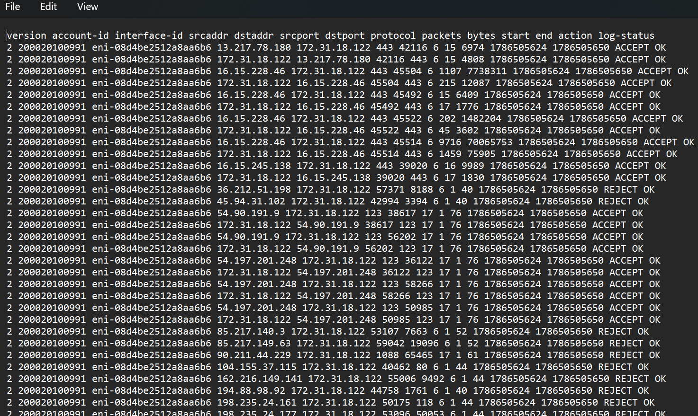
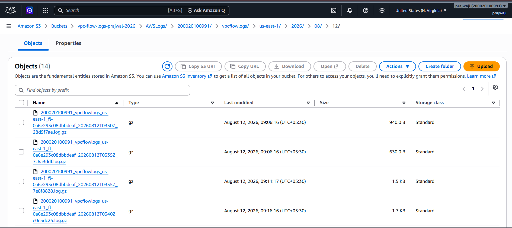

# Configure VPC Flow Logs and Store Logs in Amazon S3 Using IAM

## Project Overview

This project demonstrates how to configure Amazon VPC Flow Logs and store network traffic logs in an Amazon S3 bucket.

VPC Flow Logs provide visibility into network traffic flowing through network interfaces in a VPC. The collected logs can be used for:

- Network troubleshooting
- Security auditing
- Traffic monitoring
- Identifying rejected connections
- Investigating unexpected network activity
- Long-term log storage and analysis

---

# Architecture

```text
                         ┌──────────────────────┐
                         │         EC2          │
                         │    172.31.18.122     │
                         │                      │
                         │     ping / curl      │
                         └──────────┬───────────┘
                                    │
                                    │ Network Traffic
                                    ▼
                         ┌──────────────────────┐
                         │         VPC          │
                         │ vpc-0a79174cf996a9f27│
                         └──────────┬───────────┘
                                    │
                                    │ Flow Logs
                                    ▼
                  ┌────────────────────────────────┐
                  │      VPC Flow Logs Service     │
                  │                                │
                  │       Traffic Type: ALL        │
                  │        ACCEPT + REJECT         │
                  └───────────────┬────────────────┘
                                  │
                                  │ Log Delivery
                                  ▼
                  ┌────────────────────────────────┐
                  │           S3 Bucket             │
                  │                                │
                  │   vpc-flow-logs-prajwal-2026  │
                  └───────────────┬────────────────┘
                                  │
                                  ▼
                           ┌─────────────┐
                           │ AWSLogs/... │
                           └──────┬──────┘
                                  │
                                  ▼
                           ┌─────────────┐
                           │   .log.gz   │
                           │     file    │
                           └──────┬──────┘
                                  │
                                  ▼
                  ┌──────────────────────────┐
                  │     Analyze Log Fields   │
                  │                          │
                  │ Source IP                │
                  │ Destination IP           │
                  │ Source/Destination Port  │
                  │ Protocol                 │
                  │ Packets / Bytes          │
                  │ ACCEPT / REJECT          │
                  └──────────────────────────┘
```

### Architecture Flow

1. The EC2 instance (`172.31.18.122`) generates network traffic using commands such as `ping` and `curl`.
2. The traffic passes through the configured VPC.
3. VPC Flow Logs capture the traffic with **Traffic Type = ALL**.
4. Flow Log records are delivered to the S3 bucket.
5. AWS stores the Flow Log files under the `AWSLogs/` directory structure.
6. The log files contain information such as source IP, destination IP, ports, protocol, packets, bytes, and traffic action.
7. The logs can be analyzed for security auditing, troubleshooting, monitoring, and traffic analysis.


---

# AWS Services Used

| Service | Purpose |
|---|---|
| Amazon VPC | Provides the virtual network |
| VPC Flow Logs | Captures network traffic information |
| Amazon S3 | Stores Flow Log files |
| AWS IAM | Provides role and permission configuration |
| Amazon EC2 | Generates network traffic for testing |

---


# Environment Details

| Configuration | Value |
|---|---|
| AWS Region | `us-east-1` |
| AWS Account ID | `200020100991` |
| VPC ID | `vpc-0a79174cf996a9f27` |
| EC2 Private IP | `172.31.18.122` |
| Network Interface | `eni-08d4be2512a8aa6b6` |
| Flow Log Name | `VPC-All-Traffic-Flow-Logs` |
| Flow Log ID | `fl-0a6e293c08dbbdeaf` |
| Traffic Type | `ALL` |
| Destination | Amazon S3 |
| S3 Bucket | `vpc-flow-logs-prajwal-2026` |
| Aggregation Interval | `1 minute` |
| File Format | Plain text |
| Log Format | Default |
| IAM Role | `VPCFlowLogsS3Role` |

---


# 1. Identify the VPC

An existing VPC was used for this project instead of creating a new custom VPC.

The VPC used for the Flow Logs configuration is:

```text
VPC ID:
vpc-0a79174cf996a9f27
```

The VPC was selected from:

```text
AWS Console
    |
    +-- VPC
         |
         +-- Your VPCs
```

## VPC Configuration



The screenshot shows:

- VPC ID
- VPC CIDR
- Region
- VPC state

---

# 2. Create the S3 Bucket

A dedicated S3 bucket was created to store the VPC Flow Logs.

**Bucket name:**

```text
vpc-flow-logs-prajwal-2026
```

**Region:**

```text
us-east-1
```

The bucket was configured with:

- Block Public Access enabled
- ACLs disabled
- Bucket owner enforced
- Server-side encryption using SSE-S3

The bucket is private and is used only for log storage.

## S3 Bucket Screenshot



The screenshot shows the bucket name and its contents.

---

# 3. IAM Role Configuration

An IAM role named:

```text
VPCFlowLogsS3Role
```

was created.

The role ARN is:

```text
arn:aws:iam::200020100991:role/VPCFlowLogsS3Role
```

The role is trusted by the VPC Flow Logs service.

## Trust Relationship

```json
{
  "Version": "2012-10-17",
  "Statement": [
    {
      "Effect": "Allow",
      "Principal": {
        "Service": "vpc-flow-logs.amazonaws.com"
      },
      "Action": "sts:AssumeRole"
    }
  ]
}
```

The trust relationship allows the VPC Flow Logs service to assume the IAM role.

## IAM Role Screenshot



---

# 4. IAM Permissions Policy

The IAM role was given permissions required for S3 log delivery.

The policy allows:

```text
s3:GetBucketLocation
s3:PutObject
```

## IAM Policy

```json
{
  "Version": "2012-10-17",
  "Statement": [
    {
      "Effect": "Allow",
      "Action": "s3:GetBucketLocation",
      "Resource": "arn:aws:s3:::vpc-flow-logs-prajwal-2026"
    },
    {
      "Effect": "Allow",
      "Action": "s3:PutObject",
      "Resource": "arn:aws:s3:::vpc-flow-logs-prajwal-2026/AWSLogs/*"
    }
  ]
}
```

### Why These Permissions?

- `s3:GetBucketLocation` allows the delivery mechanism to determine the location of the S3 bucket.
- `s3:PutObject` allows log objects to be written into the S3 bucket.

Only the required S3 permissions were granted instead of giving the role full S3 access.

## IAM Permissions Screenshot



---

# 5. S3 Bucket Policy

The S3 bucket policy allows the AWS log delivery service to write VPC Flow Log objects into the bucket.

## Example Bucket Policy

```json
{
  "Version": "2012-10-17",
  "Statement": [
    {
      "Sid": "AWSLogDeliveryAclCheck",
      "Effect": "Allow",
      "Principal": {
        "Service": "delivery.logs.amazonaws.com"
      },
      "Action": "s3:GetBucketAcl",
      "Resource": "arn:aws:s3:::vpc-flow-logs-prajwal-2026"
    },
    {
      "Sid": "AWSLogDeliveryWrite",
      "Effect": "Allow",
      "Principal": {
        "Service": "delivery.logs.amazonaws.com"
      },
      "Action": "s3:PutObject",
      "Resource": "arn:aws:s3:::vpc-flow-logs-prajwal-2026/AWSLogs/*",
      "Condition": {
        "StringEquals": {
          "aws:SourceAccount": "200020100991"
        }
      }
    }
  ]
}
```

> **Note:** The exact AWS-generated S3 delivery policy can vary depending on the delivery configuration. Keep this example synchronized with the policy currently configured in your AWS account.

## S3 Bucket Policy Screenshot



---

# 6. Configure VPC Flow Logs

A VPC Flow Log was created for:

```text
vpc-0a79174cf996a9f27
```

**Flow Log name:**

```text
VPC-All-Traffic-Flow-Logs
```

**Flow Log ID:**

```text
fl-0a6e293c08dbbdeaf
```

## Configuration

| Setting | Value |
|---|---|
| Destination Type | S3 |
| Traffic Type | ALL |
| File Format | Plain text |
| Maximum Aggregation Interval | 1 minute |
| Log Format | Default |
| State | Active |

---

# 7. Why Traffic Type ALL Was Selected

The Flow Log was configured with:

```text
Traffic Type = ALL
```

This captures both:

```text
ACCEPT
REJECT
```

traffic.

This configuration was selected because the main objective is security auditing and network visibility.

Capturing only accepted traffic would not provide visibility into blocked connection attempts.

Capturing both accepted and rejected traffic makes it possible to:

- Monitor normal communication
- Identify rejected connections
- Troubleshoot network connectivity
- Investigate unexpected traffic
- Improve security visibility

## VPC Flow Log Screenshot



The screenshot should show:

- Flow Log name
- Traffic Type = All
- Destination = S3
- State = Active
- Aggregation interval = 1 minute

---

# 8. Generate Test Traffic

An existing EC2 instance inside the VPC was used to generate network traffic.

**EC2 private IP:**

```text
172.31.18.122
```

The EC2 instance was used instead of launching a new instance.

## ICMP Traffic Test

The following command was executed:

```bash
ping -c 4 8.8.8.8
```

### Result

```text
4 packets transmitted
4 packets received
0% packet loss
```

This confirmed that ICMP traffic was successfully generated.

## HTTPS Traffic Test

The following command was executed:

```bash
curl -I https://example.com
```

The response returned:

```text
HTTP/2 200
```

This confirmed successful HTTPS traffic.

---

# 9. Verify Logs in S3

After generating traffic, the VPC Flow Log records were delivered to the S3 bucket.

The S3 bucket contained AWS-generated Flow Log files.

The log directory structure is managed by AWS and may resemble:

```text
AWSLogs/
└── 200020100991/
    └── vpcflowlogs/
        └── us-east-1/
            └── 2026/
                └── 08/
                    └── 12/
                        └── FlowLogFile.log.gz
```

> **Note:** The exact path and file naming can vary depending on the AWS Flow Logs delivery configuration.

## Flow Logs in S3



The screenshot shows the generated Flow Log files.

---

# 10. Sample Flow Log

The following real Flow Log record was obtained from the S3 bucket:

```text
2 200020100991 eni-08d4be2512a8aa6b6 172.31.18.122 13.217.78.180 42116 443 6 16 4894 1786505660 1786505682 ACCEPT OK
```

## Sample Log Screenshot


---

# 11. Sample Log Explanation

The default Flow Log format contains the following fields:

```text
version
account-id
interface-id
srcaddr
dstaddr
srcport
dstport
protocol
packets
bytes
start
end
action
log-status
```

## Sample Record

```text
2
200020100991
eni-08d4be2512a8aa6b6
172.31.18.122
13.217.78.180
42116
443
6
16
4894
1786505660
1786505682
ACCEPT
OK
```

## Field Explanation

| Field | Value | Explanation |
|---|---|---|
| Version | `2` | Flow Log version |
| Account ID | `200020100991` | AWS account ID |
| Interface ID | `eni-08d4be2512a8aa6b6` | Network interface used by the traffic |
| Source IP | `172.31.18.122` | Private IP of the EC2 instance |
| Destination IP | `13.217.78.180` | Remote destination |
| Source Port | `42116` | Temporary client port |
| Destination Port | `443` | HTTPS port |
| Protocol | `6` | TCP |
| Packets | `16` | Number of packets |
| Bytes | `4894` | Number of bytes transferred |
| Start | `1786505660` | Start timestamp |
| End | `1786505682` | End timestamp |
| Action | `ACCEPT` | Traffic was allowed |
| Log Status | `OK` | Log was successfully recorded |

---

# 12. REJECT Traffic Verification

Because the Flow Log was configured with:

```text
Traffic Type = ALL
```

the S3 log also contained rejected traffic.

## Example

```text
2 200020100991 eni-08d4be2512a8aa6b6 36.212.51.198 172.31.18.122 57371 8188 6 1 40 1786505624 1786505650 REJECT OK
```

### Important Fields

| Field | Value |
|---|---|
| Source IP | `36.212.51.198` |
| Destination IP | `172.31.18.122` |
| Destination Port | `8188` |
| Protocol | `6 (TCP)` |
| Action | `REJECT` |
| Log Status | `OK` |

This demonstrates that VPC Flow Logs can record rejected network connection attempts in addition to accepted traffic.

---

# 13. Traffic Types Observed

The collected Flow Logs demonstrated multiple types of network traffic.

## TCP

**Protocol:**

```text
6
```

**Example:**

```text
Destination Port: 443
Action: ACCEPT
```

This represents HTTPS/TCP traffic.

## UDP

**Protocol:**

```text
17
```

**Example:**

```text
Destination Port: 123
Action: ACCEPT
```

Port 123 is commonly used for NTP time synchronization.

## ICMP

**Protocol:**

```text
1
```

The logs also contained ICMP traffic.

## ACCEPT

**Example:**

```text
ACCEPT OK
```

This indicates that the traffic was accepted by the network controls.

## REJECT

**Example:**

```text
REJECT OK
```

This indicates that the traffic was rejected.

---

# 14. Importance of VPC Flow Logs

VPC Flow Logs are useful for:

## Security Auditing

They provide visibility into network connections and rejected traffic.

## Troubleshooting

Flow Logs can help determine whether traffic is reaching a network interface and whether it is being accepted or rejected.

## Network Monitoring

Administrators can analyze source IPs, destination IPs, ports, protocols, packet counts, and transferred bytes.

## Incident Investigation

Unexpected connection attempts can be identified and investigated.

## Long-Term Storage

Storing Flow Logs in S3 provides durable storage for later analysis and auditing.

---

# 15. Security Considerations

The S3 bucket was configured as a private bucket.

Public access was blocked.

The IAM permissions were restricted to the required S3 actions.

The bucket should not be made publicly accessible because Flow Logs can contain sensitive network information such as:

- Internal IP addresses
- External IP addresses
- Ports
- Network interface IDs
- Traffic patterns

---

# 16. Project Result

The VPC Flow Logs implementation was successfully completed.

The following components were configured:

```text
VPC
 |
 +-- EC2
 |
 +-- VPC Flow Logs
       |
       +-- Traffic Type: ALL
       |
       +-- Destination: S3
              |
              +-- Flow Log Files
```

Network traffic was generated from the EC2 instance and successfully captured by VPC Flow Logs.

The resulting Flow Log files were stored in the Amazon S3 bucket.

Both ACCEPT and REJECT traffic records were successfully observed.

---

# 17. Conclusion

This project demonstrates how Amazon VPC Flow Logs can be used to capture network traffic information and store it in Amazon S3.

The solution provides visibility into network traffic including source and destination addresses, ports, protocols, packet counts, bytes transferred, and traffic actions.

The use of `ALL` traffic provides comprehensive visibility by capturing both accepted and rejected connections.

The collected logs can be used for network troubleshooting, security auditing, monitoring, and long-term analysis.
